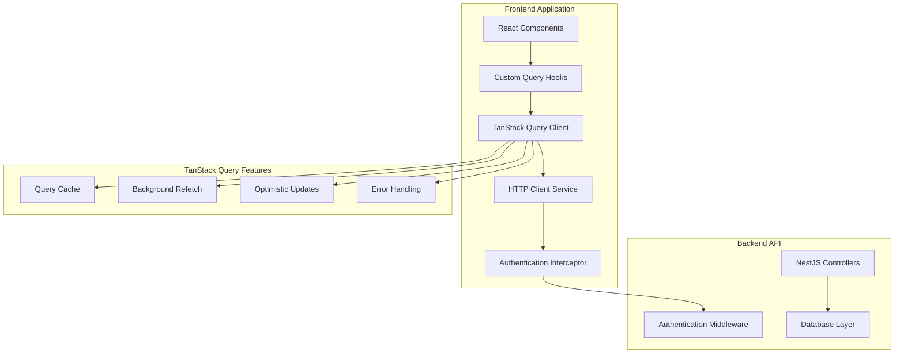
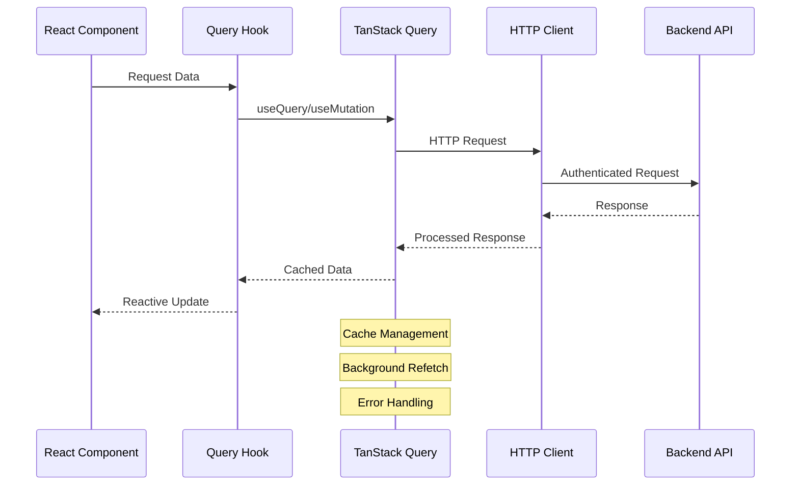

# Design Document: API Integration with TanStack Query

## Overview

This design outlines the integration of the existing backend APIs with the frontend React application using TanStack Query (React Query) for efficient data fetching, caching, and state management. The current implementation uses Zustand stores with local storage persistence, which will be replaced with server-side API integration while maintaining the same user experience and component interfaces.

TanStack Query provides powerful features including intelligent caching, background synchronization, optimistic updates, and automatic retry mechanisms that will significantly improve the application's performance and user experience.

## Architecture

### High-Level Architecture



### Data Flow Architecture



## Components and Interfaces

### 1. TanStack Query Configuration

**QueryClient Setup**
- Configure default query options (stale time, cache time, retry policies)
- Set up error handling and retry logic appropriate for business applications
- Enable React Query DevTools for development environment
- Configure background refetch settings for optimal user experience

**Default Configuration:**
```typescript
const queryClient = new QueryClient({
  defaultOptions: {
    queries: {
      staleTime: 5 * 60 * 1000, // 5 minutes
      gcTime: 10 * 60 * 1000, // 10 minutes (formerly cacheTime)
      retry: (failureCount, error) => {
        if (error.status === 401 || error.status === 403) return false
        return failureCount < 3
      },
      refetchOnWindowFocus: true,
      refetchOnReconnect: true,
    },
    mutations: {
      retry: 1,
    },
  },
})
```

### 2. HTTP Client Service

**API Client Interface:**
```typescript
interface ApiClient {
  get<T>(url: string, config?: RequestConfig): Promise<T>
  post<T>(url: string, data?: any, config?: RequestConfig): Promise<T>
  put<T>(url: string, data?: any, config?: RequestConfig): Promise<T>
  patch<T>(url: string, data?: any, config?: RequestConfig): Promise<T>
  delete<T>(url: string, config?: RequestConfig): Promise<T>
}
```

**Authentication Integration:**
- Automatic token injection for all requests
- Token refresh mechanism with retry logic
- Request/response interceptors for error handling
- Automatic logout on authentication failures

### 3. Query Hooks Architecture

**Query Hook Pattern:**
```typescript
// Generic query hook structure
function useEntityQuery<T>(
  queryKey: QueryKey,
  queryFn: QueryFunction<T>,
  options?: UseQueryOptions<T>
) {
  return useQuery({
    queryKey,
    queryFn,
    ...options,
  })
}

// Generic mutation hook structure
function useEntityMutation<TData, TVariables>(
  mutationFn: MutationFunction<TData, TVariables>,
  options?: UseMutationOptions<TData, Error, TVariables>
) {
  return useMutation({
    mutationFn,
    ...options,
  })
}
```

### 4. Authentication Hooks

**Authentication Query Hooks:**
```typescript
// User profile query
function useUserProfile() {
  return useQuery({
    queryKey: ['auth', 'profile'],
    queryFn: () => authApi.getProfile(),
    enabled: !!getAuthToken(),
  })
}

// Authentication mutations
function useLogin() {
  return useMutation({
    mutationFn: authApi.login,
    onSuccess: (data) => {
      setAuthTokens(data.accessToken, data.refreshToken)
      queryClient.invalidateQueries({ queryKey: ['auth'] })
    },
  })
}

function useLogout() {
  return useMutation({
    mutationFn: authApi.logout,
    onSuccess: () => {
      clearAuthTokens()
      queryClient.clear()
    },
  })
}
```

### 5. Customer Management Hooks

**Customer Query Hooks:**
```typescript
// Customers list with pagination and search
function useCustomers(params: CustomerQueryParams) {
  return useQuery({
    queryKey: ['customers', params],
    queryFn: () => customerApi.getCustomers(params),
    keepPreviousData: true, // For pagination
  })
}

// Individual customer
function useCustomer(id: string) {
  return useQuery({
    queryKey: ['customers', id],
    queryFn: () => customerApi.getCustomer(id),
    enabled: !!id,
  })
}
```

**Customer Mutation Hooks:**
```typescript
function useCreateCustomer() {
  return useMutation({
    mutationFn: customerApi.createCustomer,
    onSuccess: () => {
      queryClient.invalidateQueries({ queryKey: ['customers'] })
    },
  })
}

function useUpdateCustomer() {
  return useMutation({
    mutationFn: ({ id, data }: { id: string; data: UpdateCustomerDto }) =>
      customerApi.updateCustomer(id, data),
    onSuccess: (_, { id }) => {
      queryClient.invalidateQueries({ queryKey: ['customers'] })
      queryClient.invalidateQueries({ queryKey: ['customers', id] })
    },
  })
}
```

### 6. Invoice Management Hooks

**Invoice Query Hooks:**
```typescript
// Invoices list with filtering
function useInvoices(filters: InvoiceFilters) {
  return useQuery({
    queryKey: ['invoices', filters],
    queryFn: () => invoiceApi.getInvoices(filters),
    keepPreviousData: true,
  })
}

// Individual invoice with line items
function useInvoice(id: string) {
  return useQuery({
    queryKey: ['invoices', id],
    queryFn: () => invoiceApi.getInvoice(id),
    enabled: !!id,
  })
}
```

**Invoice Mutation Hooks with Optimistic Updates:**
```typescript
function useUpdateInvoiceStatus() {
  return useMutation({
    mutationFn: ({ id, status }: { id: string; status: InvoiceStatus }) =>
      invoiceApi.updateInvoiceStatus(id, status),
    onMutate: async ({ id, status }) => {
      // Cancel outgoing refetches
      await queryClient.cancelQueries({ queryKey: ['invoices', id] })
      
      // Snapshot previous value
      const previousInvoice = queryClient.getQueryData(['invoices', id])
      
      // Optimistically update
      queryClient.setQueryData(['invoices', id], (old: Invoice) => ({
        ...old,
        status,
        updatedAt: new Date(),
      }))
      
      return { previousInvoice }
    },
    onError: (err, { id }, context) => {
      // Rollback on error
      queryClient.setQueryData(['invoices', id], context?.previousInvoice)
    },
    onSettled: (_, __, { id }) => {
      // Refetch to ensure consistency
      queryClient.invalidateQueries({ queryKey: ['invoices', id] })
      queryClient.invalidateQueries({ queryKey: ['invoices'] })
    },
  })
}
```

### 7. Company Profile Hooks

**Company Profile Hooks:**
```typescript
function useCompanyProfile() {
  return useQuery({
    queryKey: ['company', 'profile'],
    queryFn: companyApi.getProfile,
  })
}

function useUploadLogo() {
  return useMutation({
    mutationFn: companyApi.uploadLogo,
    onSuccess: () => {
      queryClient.invalidateQueries({ queryKey: ['company', 'profile'] })
    },
  })
}
```

## Data Models

### Query Key Structure

Consistent query key structure for efficient cache management:

```typescript
// Query key patterns
const queryKeys = {
  // Authentication
  auth: ['auth'] as const,
  profile: () => [...queryKeys.auth, 'profile'] as const,
  
  // Customers
  customers: ['customers'] as const,
  customersList: (params: CustomerQueryParams) => 
    [...queryKeys.customers, 'list', params] as const,
  customer: (id: string) => [...queryKeys.customers, id] as const,
  
  // Invoices
  invoices: ['invoices'] as const,
  invoicesList: (filters: InvoiceFilters) => 
    [...queryKeys.invoices, 'list', filters] as const,
  invoice: (id: string) => [...queryKeys.invoices, id] as const,
  
  // Company
  company: ['company'] as const,
  companyProfile: () => [...queryKeys.company, 'profile'] as const,
}
```

### API Response Types

```typescript
// Paginated response wrapper
interface PaginatedResponse<T> {
  data: T[]
  total: number
  page: number
  limit: number
  totalPages: number
}

// API error response
interface ApiError {
  message: string
  statusCode: number
  error?: string
  details?: Record<string, any>
}

// Authentication response
interface AuthResponse {
  accessToken: string
  refreshToken: string
  user: User
}
```

### Request/Response DTOs

The design will use the existing DTOs from the backend:
- `CreateCustomerDto`, `UpdateCustomerDto`, `CustomerResponseDto`
- `CreateInvoiceDto`, `UpdateInvoiceDto`, `InvoiceResponseDto`
- `CreateCompanyProfileDto`, `UpdateCompanyProfileDto`, `CompanyProfileResponseDto`
- `LoginDto`, `RegisterDto`, `AuthResponseDto`

## Correctness Properties

*A property is a characteristic or behavior that should hold true across all valid executions of a system—essentially, a formal statement about what the system should do. Properties serve as the bridge between human-readable specifications and machine-verifiable correctness guarantees.*

<function_calls>
<invoke name="prework">
<parameter name="featureName">api-integration-tanstack-query

### Property Reflection

After analyzing all acceptance criteria, I identified several areas where properties can be consolidated:

**Redundancy Analysis:**
- Properties for optimistic updates (4.6, 5.7, 9.3) can be combined into one comprehensive property about optimistic update behavior
- Properties for error handling and user feedback (8.1, 8.2, 8.3, 8.5) can be consolidated into comprehensive error handling properties
- Properties for cache invalidation (7.1, 7.6) cover the general behavior, while specific examples (7.2, 7.3, 7.4) test concrete cases
- Properties for request cancellation (2.6, 9.6) can be combined as they test the same underlying behavior

**Final Property Set:**
The following properties provide comprehensive coverage without redundancy:

### Converting EARS to Properties

Based on the prework analysis, here are the testable correctness properties:

**Property 1: Authentication Token Inclusion**
*For any* API request made through the API client, the request should automatically include the current authentication token in the Authorization header
**Validates: Requirements 2.1**

**Property 2: Token Refresh on Expiration**
*For any* API request that receives a 401 response due to token expiration, the system should attempt to refresh the token and retry the original request
**Validates: Requirements 2.2**

**Property 3: Logout on Token Refresh Failure**
*For any* token refresh attempt that fails, the system should redirect the user to the login page and clear all authentication state
**Validates: Requirements 2.3**

**Property 4: HTTP Error Handling**
*For any* API request that fails with common HTTP errors (401, 403, 500), the system should display appropriate user feedback without crashing
**Validates: Requirements 2.4**

**Property 5: Request Cancellation on Unmount**
*For any* component that makes API requests, when the component unmounts, all in-flight requests should be cancelled to prevent memory leaks
**Validates: Requirements 2.6, 9.6**

**Property 6: Authentication State Reactivity**
*For any* change in authentication state (login, logout, token refresh), the UI should update reactively to reflect the new state
**Validates: Requirements 3.6**

**Property 7: Search Parameter Transmission**
*For any* search or filter operation on customers or invoices, the corresponding query parameters should be properly transmitted to the API
**Validates: Requirements 4.5, 5.6**

**Property 8: Optimistic Updates**
*For any* mutation operation (create, update, delete), the UI should update immediately before server confirmation to provide immediate feedback
**Validates: Requirements 4.6, 5.7, 9.3**

**Property 9: Validation Error Display**
*For any* API request that returns validation errors, the system should display field-specific error messages in the appropriate UI components
**Validates: Requirements 4.7, 8.5**

**Property 10: Complex Data Handling**
*For any* invoice data containing line items and calculations, the system should properly serialize, transmit, and deserialize the complex data structure
**Validates: Requirements 5.8**

**Property 11: File Upload Error Handling**
*For any* file upload operation, the system should handle progress updates and validation errors appropriately
**Validates: Requirements 6.5**

**Property 12: Cache Invalidation on Mutations**
*For any* successful mutation operation, the system should invalidate related queries to ensure data consistency
**Validates: Requirements 7.1**

**Property 13: Background Refetch on Focus**
*For any* query, when the application regains focus after being in the background, the system should refetch data to ensure freshness
**Validates: Requirements 7.6**

**Property 14: Loading State Display**
*For any* API request in progress, the system should display appropriate loading indicators in the UI
**Validates: Requirements 8.1, 9.5**

**Property 15: Error Message Display**
*For any* failed API request, the system should display user-friendly error messages
**Validates: Requirements 8.2**

**Property 16: Success Notification Display**
*For any* successful mutation, the system should display success notifications to confirm the operation
**Validates: Requirements 8.3**

**Property 17: Offline Status Indication**
*For any* network connectivity loss, the system should indicate offline status and queue operations when possible
**Validates: Requirements 8.4**

**Property 18: Retry Mechanism**
*For any* failed operation that is retryable, the system should provide retry mechanisms according to the configured retry policy
**Validates: Requirements 8.6, 1.4**

**Property 19: Query Caching**
*For any* repeated API request with the same parameters, the system should use cached data instead of making unnecessary network requests
**Validates: Requirements 9.1**

**Property 20: Pagination Parameter Transmission**
*For any* paginated data request, the system should properly transmit pagination parameters and handle paginated responses
**Validates: Requirements 9.2**

**Property 21: Related Data Prefetching**
*For any* data view that requires related data, the system should prefetch related data when appropriate to improve performance
**Validates: Requirements 9.4**

## Error Handling

### Error Classification and Handling Strategy

**Network Errors:**
- Connection timeouts: Automatic retry with exponential backoff
- Network unavailable: Queue operations and retry when connection restored
- DNS resolution failures: Display offline indicator and retry

**HTTP Status Errors:**
- 400 Bad Request: Display validation errors from server response
- 401 Unauthorized: Attempt token refresh, logout if refresh fails
- 403 Forbidden: Display access denied message
- 404 Not Found: Display resource not found message
- 409 Conflict: Display conflict resolution options
- 422 Unprocessable Entity: Display validation errors
- 500+ Server Errors: Display generic error message with retry option

**Client-Side Errors:**
- Request cancellation: Silent handling, no user notification
- Serialization errors: Display data format error message
- Validation errors: Display field-specific error messages

### Error Recovery Mechanisms

**Automatic Recovery:**
- Token refresh on 401 errors
- Automatic retry for transient network errors
- Background refetch on network reconnection

**User-Initiated Recovery:**
- Manual retry buttons for failed operations
- Refresh page option for persistent errors
- Clear cache option for data inconsistencies

## Testing Strategy

### Dual Testing Approach

The testing strategy employs both unit tests and property-based tests to ensure comprehensive coverage:

**Unit Tests:**
- Test specific API endpoint integrations
- Test error handling for known error scenarios
- Test component integration with query hooks
- Test authentication flow edge cases
- Test file upload functionality
- Test cache invalidation for specific operations

**Property-Based Tests:**
- Test universal properties across all API operations
- Test error handling behavior across different error types
- Test caching behavior with various request patterns
- Test optimistic updates with different data types
- Test retry mechanisms with various failure scenarios

**Property Test Configuration:**
- Minimum 100 iterations per property test
- Use React Testing Library with MSW (Mock Service Worker) for API mocking
- Each property test references its design document property
- Tag format: **Feature: api-integration-tanstack-query, Property {number}: {property_text}**

**Testing Framework:**
- **Unit Tests:** Vitest with React Testing Library
- **Property Tests:** Vitest with fast-check for property-based testing
- **API Mocking:** MSW (Mock Service Worker) for realistic API simulation
- **Integration Tests:** Playwright for end-to-end testing

### Test Coverage Requirements

**Query Hooks Testing:**
- Test successful data fetching
- Test loading states
- Test error states
- Test cache behavior
- Test background refetch

**Mutation Hooks Testing:**
- Test successful mutations
- Test optimistic updates
- Test error rollback
- Test cache invalidation
- Test retry behavior

**Authentication Testing:**
- Test login/logout flows
- Test token refresh mechanism
- Test automatic logout on token failure
- Test protected route access

**Integration Testing:**
- Test complete user workflows
- Test offline/online transitions
- Test concurrent operations
- Test data consistency across components