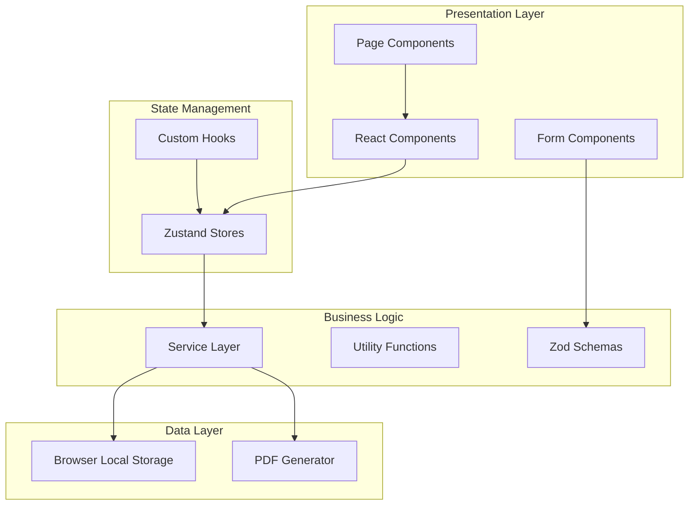
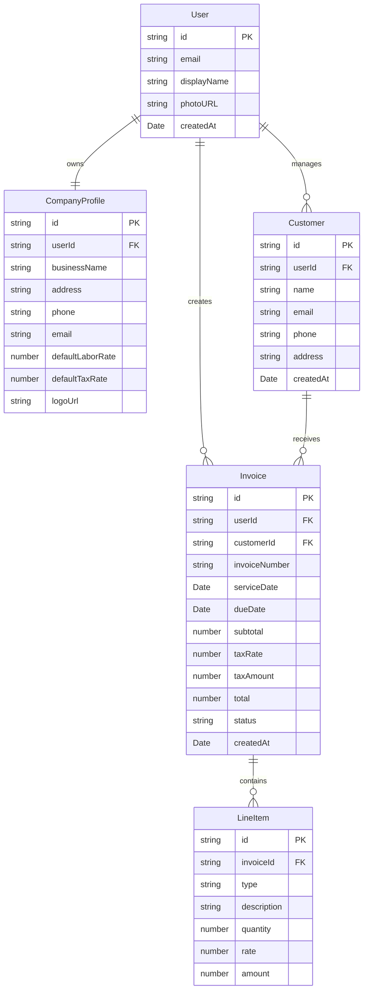

# Design Document: Electrician Invoice Generation Web App

## Overview

The Electrician Invoice Generation Web App is a modern, single-page React application built with TypeScript that enables electricians to manage their business operations efficiently. The application provides comprehensive functionality for company profile management, customer relationship management, and professional invoice generation with PDF export capabilities.

The system architecture follows React best practices with a component-based design, centralized state management using Zustand, and local storage for data persistence. The application emphasizes type safety, user experience, and maintainability through modern tooling including Vite, Tailwind CSS, React Hook Form with Zod validation, and @react-pdf/renderer for PDF generation.

## Architecture

### High-Level Architecture



### Technology Stack

- **Frontend Framework**: React 18 with TypeScript
- **Build Tool**: Vite for fast development and optimized builds
- **Styling**: Tailwind CSS for utility-first styling
- **State Management**: Zustand for lightweight, scalable state management
- **Form Handling**: React Hook Form with Zod for type-safe validation
- **PDF Generation**: @react-pdf/renderer for professional invoice PDFs
- **Data Persistence**: Browser Local Storage with JSON serialization
- **UI Components**: Headless UI for accessible components
- **Icons**: Lucide React for consistent iconography

### Folder Structure

The application follows a feature-based architecture with clear separation of concerns:

```
src/
├── components/          # Reusable UI components
│   ├── ui/             # Base UI components (Button, Input, etc.)
│   ├── layout/         # Layout components (Header, Sidebar)
│   ├── features/       # Feature-specific components
│   └── shared/         # Shared utility components
├── hooks/              # Custom React hooks
├── store/              # Zustand state stores
├── services/           # Business logic and data services
├── types/              # TypeScript type definitions
├── utils/              # Utility functions and constants
├── pages/              # Page-level components
└── routes/             # Routing configuration
```

## Components and Interfaces

### Core Components

#### UI Components (`src/components/ui/`)

**Button Component**

- Variants: primary, secondary, outline, ghost
- Sizes: small, medium, large
- States: default, loading, disabled
- Full accessibility support with ARIA attributes

**Input Component**

- Types: text, email, tel, number, password
- Validation state indicators (error, success)
- Label and help text support
- Integration with React Hook Form

**Card Component**

- Container for grouped content
- Header, body, and footer sections
- Responsive design with consistent spacing

**Modal Component**

- Overlay-based dialog system
- Focus management and keyboard navigation
- Customizable size and positioning
- Integration with Headless UI Dialog

#### Layout Components (`src/components/layout/`)

**MainLayout Component**

- Primary application shell
- Responsive sidebar navigation
- Header with user actions
- Main content area with proper spacing

**Header Component**

- Application branding and navigation
- User authentication status
- Quick actions (logout, settings)
- Mobile-responsive hamburger menu

**Sidebar Component**

- Primary navigation menu
- Active state indicators
- Collapsible on mobile devices
- Role-based menu items

#### Feature Components

**Authentication Components (`src/components/features/auth/`)**

- LoginForm: Email/password authentication
- SignupForm: User registration with validation
- Form validation using Zod schemas
- Error handling and loading states

**Company Profile Components (`src/components/features/company/`)**

- CompanyProfileForm: Business information management
- LogoUploader: Image upload with preview
- Integration with local storage persistence

**Customer Management Components (`src/components/features/customers/`)**

- CustomerList: Paginated customer display
- CustomerForm: Add/edit customer information
- CustomerCard: Individual customer summary
- Search and filtering capabilities

**Invoice Components (`src/components/features/invoices/`)**

- InvoiceBuilder: Multi-step invoice creation
- LineItemsTable: Dynamic line item management
- InvoicePreview: Real-time invoice preview
- InvoicePDF: PDF generation component

### State Management Architecture

#### Zustand Store Structure

**Auth Store (`src/store/authStore.ts`)**

```typescript
interface AuthStore {
  user: User | null
  loading: boolean
  error: string | null
  login: (email: string, password: string) => Promise<void>
  signup: (
    email: string,
    password: string,
    displayName: string
  ) => Promise<void>
  logout: () => Promise<void>
  setUser: (user: User | null) => void
}
```

**Company Store (`src/store/companyStore.ts`)**

```typescript
interface CompanyStore {
  profile: CompanyProfile | null
  loading: boolean
  error: string | null
  createProfile: (data: CompanyProfileFormData) => Promise<void>
  updateProfile: (data: Partial<CompanyProfileFormData>) => Promise<void>
  uploadLogo: (file: File) => Promise<string>
}
```

**Customer Store (`src/store/customerStore.ts`)**

```typescript
interface CustomerStore {
  customers: Customer[]
  loading: boolean
  error: string | null
  addCustomer: (data: CustomerFormData) => Promise<void>
  updateCustomer: (id: string, data: Partial<CustomerFormData>) => Promise<void>
  deleteCustomer: (id: string) => Promise<void>
  getCustomer: (id: string) => Customer | null
}
```

**Invoice Store (`src/store/invoiceStore.ts`)**

```typescript
interface InvoiceStore {
  invoices: Invoice[]
  currentInvoice: Invoice | null
  loading: boolean
  error: string | null
  createInvoice: (data: InvoiceFormData) => Promise<void>
  updateInvoice: (id: string, data: Partial<InvoiceFormData>) => Promise<void>
  deleteInvoice: (id: string) => Promise<void>
  generateInvoiceNumber: () => string
  calculateTotals: (lineItems: LineItem[], taxRate: number) => InvoiceTotals
}
```

### Service Layer Architecture

#### Local Storage Service (`src/services/localStorage.service.ts`)

Provides a type-safe abstraction over browser local storage with automatic JSON serialization/deserialization:

```typescript
interface LocalStorageService {
  get<T>(key: string): T | null
  set<T>(key: string, value: T): void
  remove(key: string): void
  clear(): void
  exists(key: string): boolean
}
```

#### PDF Generation Service (`src/services/pdf/pdfGenerator.service.ts`)

Handles professional PDF invoice generation using @react-pdf/renderer:

```typescript
interface PDFGeneratorService {
  generateInvoicePDF(invoice: Invoice, company: CompanyProfile): Promise<Blob>
  downloadPDF(blob: Blob, filename: string): void
  previewPDF(blob: Blob): void
}
```

## Data Models

### Core Entity Relationships



### Data Validation Schemas

Using Zod for runtime validation and TypeScript type inference:

**Company Profile Schema**

```typescript
const companyProfileSchema = z.object({
  businessName: z.string().min(1, 'Business name is required'),
  address: z.string().min(1, 'Address is required'),
  city: z.string().min(1, 'City is required'),
  state: z.string().length(2, 'State must be 2 characters'),
  zipCode: z.string().regex(/^\d{5}(-\d{4})?$/, 'Invalid zip code'),
  phone: z
    .string()
    .regex(/^\(?(\d{3})\)?[- ]?(\d{3})[- ]?(\d{4})$/, 'Invalid phone number'),
  email: z.string().email('Invalid email address'),
  taxNumber: z.string().min(1, 'Tax number is required'),
  defaultLaborRate: z.number().min(0, 'Labor rate must be positive'),
  defaultTaxRate: z.number().min(0).max(1, 'Tax rate must be between 0 and 1'),
})
```

**Invoice Schema**

```typescript
const lineItemSchema = z.object({
  id: z.string(),
  type: z.enum(['material', 'labor']),
  description: z.string().min(1, 'Description is required'),
  quantity: z.number().min(0.01, 'Quantity must be greater than 0'),
  rate: z.number().min(0, 'Rate must be positive'),
  amount: z.number(),
})

const invoiceSchema = z.object({
  customerId: z.string().min(1, 'Customer is required'),
  serviceDate: z.date(),
  dueDate: z.date(),
  lineItems: z
    .array(lineItemSchema)
    .min(1, 'At least one line item is required'),
  notes: z.string().optional(),
})
```

## Correctness Properties

_A property is a characteristic or behavior that should hold true across all valid executions of a system—essentially, a formal statement about what the system should do. Properties serve as the bridge between human-readable specifications and machine-verifiable correctness guarantees._

Based on the prework analysis, the following properties have been identified as testable and consolidated to eliminate redundancy:

### Property 1: Authentication Round Trip

_For any_ valid user credentials (email, password, display name), creating an account and then authenticating with those credentials should succeed and return the same user information
**Validates: Requirements 1.1, 1.2**

### Property 2: Session Persistence

_For any_ authenticated user, logging out should clear the session state and prevent access to protected resources
**Validates: Requirements 1.3**

### Property 3: Authentication State Persistence

_For any_ authenticated user session, refreshing the browser should maintain the authentication state
**Validates: Requirements 1.5**

### Property 4: Invalid Credentials Rejection

_For any_ invalid credentials, authentication attempts should fail with appropriate error messages
**Validates: Requirements 1.4**

### Property 5: Entity Persistence Round Trip

_For any_ valid entity (company profile, customer, invoice), creating or updating the entity should result in the same data being retrievable from local storage
**Validates: Requirements 2.1, 2.4, 3.1, 3.3, 4.8, 4.10, 7.1**

### Property 6: Entity Deletion

_For any_ existing entity, deleting it should remove it from local storage and make it no longer retrievable
**Validates: Requirements 3.4, 4.11**

### Property 7: Data Sorting Consistency

_For any_ collection of entities with creation dates, retrieving them should return them sorted by creation date in descending order
**Validates: Requirements 3.2, 4.9**

### Property 8: Line Item Amount Calculation

_For any_ line item with quantity and rate, the calculated amount should equal quantity multiplied by rate
**Validates: Requirements 4.4, 5.1**

### Property 9: Invoice Subtotal Calculation

_For any_ invoice with line items, the subtotal should equal the sum of all line item amounts
**Validates: Requirements 4.5, 5.2**

### Property 10: Invoice Tax Calculation

_For any_ invoice with subtotal and tax rate, the tax amount should equal subtotal multiplied by tax rate
**Validates: Requirements 4.6, 5.3**

### Property 11: Invoice Total Calculation

_For any_ invoice with subtotal and tax amount, the total should equal subtotal plus tax amount
**Validates: Requirements 4.7, 5.4**

### Property 12: Reactive Calculation Updates

_For any_ invoice, when line items are modified, all dependent calculations (subtotal, tax amount, total) should update immediately
**Validates: Requirements 5.5**

### Property 13: Currency Rounding

_For any_ calculated currency value, the result should be rounded to exactly two decimal places
**Validates: Requirements 5.6**

### Property 14: Unique Invoice Numbers

_For any_ set of invoices created by the same user, each invoice should have a unique invoice number
**Validates: Requirements 4.1**

### Property 15: Customer Data Population

_For any_ selected customer, their information should be correctly populated in the invoice form
**Validates: Requirements 4.2**

### Property 16: Line Item Creation

_For any_ valid line item data (type, description, quantity, rate), the line item should be successfully created and stored
**Validates: Requirements 4.3**

### Property 17: PDF Generation Success

_For any_ valid invoice, requesting PDF generation should produce a downloadable PDF document
**Validates: Requirements 6.1, 6.8**

### Property 18: PDF Content Completeness

_For any_ generated PDF, it should contain all required elements: company information, customer information, invoice details, line items table, and totals
**Validates: Requirements 6.2, 6.3, 6.4, 6.5, 6.6, 6.7**

### Property 19: Date Serialization Round Trip

_For any_ date value, storing it to local storage and retrieving it should return an equivalent date
**Validates: Requirements 7.3**

### Property 20: Data Loading on Startup

_For any_ stored application data, reopening the application should load all data correctly from local storage
**Validates: Requirements 7.2**

### Property 21: Referential Integrity

_For any_ invoice with a customer reference, the customer should exist and be retrievable
**Validates: Requirements 7.4**

### Property 22: Authentication-Based Routing

_For any_ unauthenticated user, accessing protected routes should redirect to the login page
**Validates: Requirements 8.3**

### Property 23: Authenticated User Route Protection

_For any_ authenticated user, accessing login/signup pages should redirect to the dashboard
**Validates: Requirements 8.4**

### Property 24: Loading State Display

_For any_ asynchronous operation, loading indicators should be displayed during execution
**Validates: Requirements 8.5**

### Property 25: Error Message Display

_For any_ failed operation, appropriate error messages should be displayed to the user
**Validates: Requirements 8.6**

### Property 26: Form Validation Error Display

_For any_ form submission with invalid data, field-specific error messages should be displayed
**Validates: Requirements 9.1**

### Property 27: Email Format Validation

_For any_ email input field, invalid email formats should be rejected with appropriate error messages
**Validates: Requirements 2.6, 3.6, 9.2**

### Property 28: Phone Format Validation

_For any_ phone input field, invalid phone formats should be rejected with appropriate error messages
**Validates: Requirements 2.6, 3.6, 9.3**

### Property 29: Zip Code Format Validation

_For any_ zip code input field, invalid zip code formats should be rejected with appropriate error messages
**Validates: Requirements 3.7, 9.4**

### Property 30: Required Field Validation

_For any_ form with required fields, submitting with empty required fields should prevent submission and show validation errors
**Validates: Requirements 2.5, 3.5, 9.5**

### Property 31: Numeric Field Validation

_For any_ numeric input field, non-numeric values should be rejected with appropriate error messages
**Validates: Requirements 9.6**

### Property 32: Form Submission Enablement

_For any_ form with valid data, form submission should be enabled
**Validates: Requirements 9.7**

### Property 33: Dashboard Statistics Accuracy

_For any_ set of invoices, dashboard statistics (total count, revenue, pending count) should accurately reflect the current data
**Validates: Requirements 10.1, 10.2, 10.3**

### Property 34: Recent Invoices Display

_For any_ set of invoices, the dashboard should display recent invoices with correct status indicators
**Validates: Requirements 10.4**

### Property 35: Dashboard Reactive Updates

_For any_ change to invoice data, dashboard statistics should update immediately to reflect the changes
**Validates: Requirements 10.5**

Now I need to analyze the acceptance criteria to determine which ones can be tested as properties:

<function_calls>
<invoke name="prework">
<parameter name="featureName">electrician-invoice-app

## Error Handling

### Error Handling Strategy

The application implements a comprehensive error handling strategy across all layers:

#### Client-Side Error Handling

**Form Validation Errors**

- Real-time validation using Zod schemas
- Field-level error messages with clear, actionable feedback
- Form submission prevention until all validation passes
- Visual indicators for error states (red borders, error icons)

**Local Storage Errors**

- Graceful degradation when local storage is unavailable
- User notification with alternative action suggestions
- Automatic retry mechanisms for transient failures
- Data backup strategies for critical operations

**PDF Generation Errors**

- Error handling for @react-pdf/renderer failures
- User feedback for unsupported browsers or missing features
- Fallback options for PDF generation issues
- Progress indicators for long-running PDF operations

#### Error Boundary Implementation

```typescript
interface ErrorBoundaryState {
  hasError: boolean
  error: Error | null
  errorInfo: ErrorInfo | null
}

class ErrorBoundary extends Component<PropsWithChildren, ErrorBoundaryState> {
  // Catches JavaScript errors anywhere in the child component tree
  // Logs error details and displays fallback UI
  // Provides error reporting mechanisms
}
```

#### Error State Management

**Zustand Error Handling**

- Centralized error state in each store
- Automatic error clearing mechanisms
- Error categorization (validation, network, system)
- User-friendly error message mapping

**Error Recovery Patterns**

- Retry mechanisms for transient failures
- Graceful degradation for non-critical features
- User-initiated error recovery actions
- Automatic error reporting for debugging

### Error Types and Responses

| Error Type            | Response Strategy                                 | User Experience                       |
| --------------------- | ------------------------------------------------- | ------------------------------------- |
| Validation Errors     | Immediate feedback with specific field errors     | Red borders, inline error messages    |
| Storage Errors        | Graceful degradation with user notification       | Warning banner with retry option      |
| PDF Generation Errors | Fallback options and clear error messaging        | Error modal with alternative actions  |
| Authentication Errors | Secure error messages without information leakage | Generic "invalid credentials" message |
| Network Errors        | Retry mechanisms with exponential backoff         | Loading states with retry buttons     |

## Testing Strategy

### Dual Testing Approach

The application employs a comprehensive testing strategy combining unit tests and property-based tests to ensure correctness and reliability:

**Unit Tests**

- Specific examples and edge cases
- Integration points between components
- Error conditions and boundary cases
- Component rendering and user interactions
- Mock external dependencies for isolated testing

**Property-Based Tests**

- Universal properties across all inputs
- Comprehensive input coverage through randomization
- Mathematical correctness of calculations
- Data persistence and retrieval consistency
- Form validation across various input combinations

### Testing Framework Configuration

**Primary Testing Stack**

- **Testing Framework**: Vitest for fast, modern testing
- **Property-Based Testing**: fast-check for JavaScript property testing
- **Component Testing**: React Testing Library for user-centric testing
- **Mocking**: Vitest's built-in mocking capabilities
- **Coverage**: Built-in coverage reporting with c8

**Property Test Configuration**

- Minimum 100 iterations per property test
- Custom generators for domain-specific data types
- Shrinking capabilities for minimal failing examples
- Deterministic seeds for reproducible test runs

### Test Organization

**Unit Test Structure**

```
src/
├── components/
│   ├── ui/
│   │   ├── Button.test.tsx
│   │   ├── Input.test.tsx
│   │   └── Card.test.tsx
│   └── features/
│       ├── auth/
│       │   ├── LoginForm.test.tsx
│       │   └── SignupForm.test.tsx
│       └── invoices/
│           ├── InvoiceBuilder.test.tsx
│           └── LineItemsTable.test.tsx
├── services/
│   ├── localStorage.service.test.ts
│   └── pdf/
│       └── pdfGenerator.service.test.ts
├── store/
│   ├── authStore.test.ts
│   ├── customerStore.test.ts
│   └── invoiceStore.test.ts
└── utils/
    ├── formatters.test.ts
    └── validators.test.ts
```

**Property Test Implementation**
Each correctness property will be implemented as a property-based test with the following format:

```typescript
// Example property test
describe('Invoice Calculations', () => {
  test('Property 8: Line Item Amount Calculation', () => {
    fc.assert(
      fc.property(
        fc.float({ min: 0.01, max: 1000 }), // quantity
        fc.float({ min: 0.01, max: 500 }), // rate
        (quantity, rate) => {
          const lineItem = createLineItem({ quantity, rate })
          const expectedAmount = Math.round(quantity * rate * 100) / 100
          expect(lineItem.amount).toBe(expectedAmount)
        }
      ),
      { numRuns: 100 }
    )
  })
})
```

**Test Tags and Organization**

- Each property test tagged with: **Feature: electrician-invoice-app, Property {number}: {property_text}**
- Unit tests organized by feature and component
- Integration tests for cross-component interactions
- End-to-end tests for critical user workflows

### Coverage Requirements

**Minimum Coverage Targets**

- Unit Test Coverage: 85% line coverage
- Property Test Coverage: All identified correctness properties
- Integration Test Coverage: All major user workflows
- Error Path Coverage: All error handling scenarios

**Coverage Exclusions**

- Type definition files
- Configuration files
- Third-party library integrations
- Development-only utilities

### Continuous Testing

**Development Workflow**

- Pre-commit hooks running fast unit tests
- Watch mode during development for immediate feedback
- Automated test runs on file changes
- Property test execution during CI/CD pipeline

**Test Data Management**

- Factories for generating test data
- Fixtures for consistent test scenarios
- Cleanup mechanisms for test isolation
- Deterministic random data generation

This comprehensive testing strategy ensures that the Electrician Invoice Generation Web App maintains high quality, reliability, and correctness throughout its development lifecycle while providing confidence in both specific behaviors and universal properties of the system.
