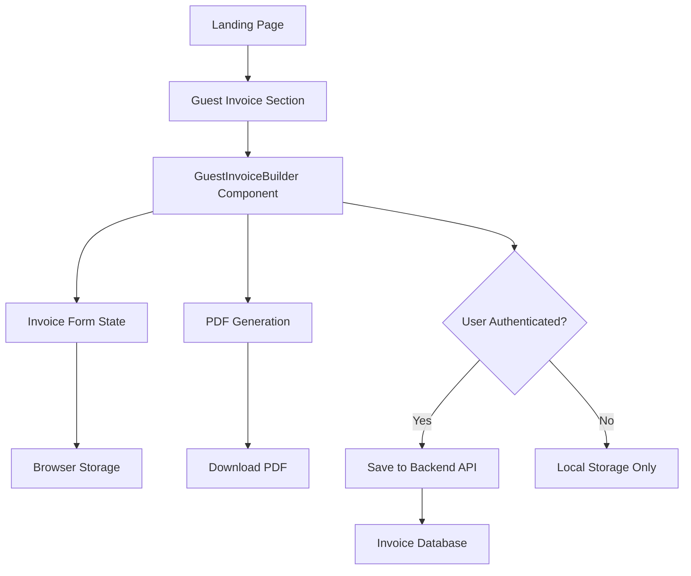
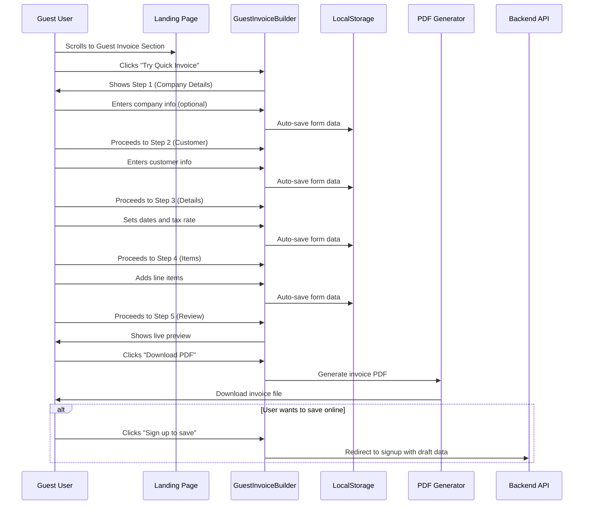

# Design Document: Guest Invoice Generation

## Overview

This feature adds a guest-accessible invoice generation section to the landing page, positioned below the hero section. It allows anonymous users to create and download professional invoices without requiring authentication or account creation. The feature reuses the existing QuickInvoiceBuilder component logic but adapts it for guest usage with browser-based storage and immediate PDF download capabilities.

## Architecture

The system follows a client-side architecture for guest users, with optional backend integration for authenticated users who want to save their invoices.



## Main Algorithm/Workflow



## Components and Interfaces

### Component 1: GuestInvoiceSection

**Purpose**: Landing page section that introduces and contains the guest invoice builder

**Interface**:
```typescript
interface GuestInvoiceSectionProps {
  className?: string
}

const GuestInvoiceSection: React.FC<GuestInvoiceSectionProps>
```

**Responsibilities**:
- Render section heading and description
- Display call-to-action to try the invoice builder
- Toggle visibility of GuestInvoiceBuilder component
- Provide visual separation from other landing page sections

### Component 2: GuestInvoiceBuilder

**Purpose**: Adapted invoice builder for guest users with local storage and PDF generation

**Interface**:
```typescript
interface GuestInvoiceBuilderProps {
  onClose?: () => void
  className?: string
}

interface GuestInvoiceData {
  company: CompanyDetails | null
  customer: CustomerDetails
  invoiceDetails: InvoiceDetails
  lineItems: LineItem[]
  notes?: string
}

const GuestInvoiceBuilder: React.FC<GuestInvoiceBuilderProps>
```

**Responsibilities**:
- Manage multi-step form wizard (5 steps: company, customer, details, items, review)
- Auto-save form data to localStorage on each change
- Restore form data from localStorage on mount
- Generate PDF from invoice data
- Provide "Download PDF" functionality
- Offer "Sign up to save" option with draft data preservation
- Clear localStorage after successful download or explicit user action

### Component 3: GuestInvoicePreview

**Purpose**: Read-only preview of the invoice for guest users

**Interface**:
```typescript
interface GuestInvoicePreviewProps {
  data: GuestInvoiceData
  className?: string
}

const GuestInvoicePreview: React.FC<GuestInvoicePreviewProps>
```

**Responsibilities**:
- Display formatted invoice preview
- Show all invoice details (company, customer, items, totals)
- Provide print-friendly layout
- Support PDF generation via browser print API

## Data Models

### Model 1: GuestInvoiceData

```typescript
interface GuestInvoiceData {
  company: CompanyDetails | null
  customer: CustomerDetails
  invoiceDetails: InvoiceDetails
  lineItems: LineItem[]
  notes?: string
  createdAt: Date
  lastModified: Date
}
```

**Validation Rules**:
- customer.name is required (minimum 2 characters)
- invoiceDetails.serviceDate is required
- invoiceDetails.dueDate is required and must be >= serviceDate
- invoiceDetails.taxRate must be between 0 and 1 (0% to 100%)
- lineItems must contain at least 1 item
- Each lineItem must have valid description, quantity > 0, rate >= 0

### Model 2: CompanyDetails

```typescript
interface CompanyDetails {
  businessName: string
  address?: string
  city?: string
  state?: string
  zipCode?: string
  phone?: string
  email?: string
  taxNumber?: string
}
```

**Validation Rules**:
- All fields are optional (guest can skip company step)
- If email provided, must be valid email format
- If phone provided, must be valid phone format

### Model 3: CustomerDetails

```typescript
interface CustomerDetails {
  name: string
  email?: string
  phone?: string
  address?: string
  city?: string
  state?: string
  zipCode?: string
}
```

**Validation Rules**:
- name is required (minimum 2 characters)
- If email provided, must be valid email format
- If phone provided, must be valid phone format

### Model 4: InvoiceDetails

```typescript
interface InvoiceDetails {
  serviceDate: Date
  dueDate: Date
  taxRate: number
}
```

**Validation Rules**:
- serviceDate is required
- dueDate is required and must be >= serviceDate
- taxRate must be between 0 and 1

### Model 5: LineItem

```typescript
interface LineItem {
  id: string
  type: 'material' | 'labor'
  description: string
  quantity: number
  rate: number
  amount: number
}
```

**Validation Rules**:
- type must be 'material' or 'labor'
- description is required (minimum 3 characters)
- quantity must be > 0
- rate must be >= 0
- amount must equal quantity * rate

## Core Interfaces/Types

```typescript
// Storage key for localStorage
const GUEST_INVOICE_STORAGE_KEY = 'guest_invoice_draft'

// Hook for managing guest invoice state
interface UseGuestInvoiceReturn {
  data: GuestInvoiceData | null
  updateData: (updates: Partial<GuestInvoiceData>) => void
  clearData: () => void
  isValid: boolean
  errors: ValidationErrors
}

function useGuestInvoice(): UseGuestInvoiceReturn

// PDF generation utility
interface GeneratePDFOptions {
  filename?: string
  autoDownload?: boolean
}

function generateInvoicePDF(
  data: GuestInvoiceData,
  options?: GeneratePDFOptions
): Promise<Blob>
```

## Key Functions with Formal Specifications

### Function 1: saveToLocalStorage()

```typescript
function saveToLocalStorage(data: GuestInvoiceData): void
```

**Preconditions:**
- `data` is a valid GuestInvoiceData object
- Browser supports localStorage
- localStorage is not full

**Postconditions:**
- Data is serialized to JSON and stored in localStorage
- `lastModified` timestamp is updated to current time
- If storage fails, error is logged but does not throw

**Loop Invariants:** N/A

### Function 2: loadFromLocalStorage()

```typescript
function loadFromLocalStorage(): GuestInvoiceData | null
```

**Preconditions:**
- Browser supports localStorage

**Postconditions:**
- Returns parsed GuestInvoiceData if valid data exists
- Returns null if no data exists or data is invalid
- Dates are properly deserialized from ISO strings
- Invalid or corrupted data is cleared from storage

**Loop Invariants:** N/A

### Function 3: validateInvoiceData()

```typescript
function validateInvoiceData(data: GuestInvoiceData): ValidationResult
```

**Preconditions:**
- `data` is defined (not null/undefined)

**Postconditions:**
- Returns ValidationResult with `isValid` boolean
- If invalid, returns array of error messages
- Validates all required fields and business rules
- No mutations to input data

**Loop Invariants:**
- For validation loops: All previously checked fields remain valid

### Function 4: calculateInvoiceTotals()

```typescript
function calculateInvoiceTotals(
  lineItems: LineItem[],
  taxRate: number
): InvoiceTotals
```

**Preconditions:**
- `lineItems` is an array (may be empty)
- `taxRate` is a number between 0 and 1
- Each lineItem has valid amount

**Postconditions:**
- Returns InvoiceTotals with subtotal, taxAmount, and total
- All amounts are rounded to 2 decimal places
- subtotal = sum of all lineItem amounts
- taxAmount = subtotal * taxRate
- total = subtotal + taxAmount

**Loop Invariants:**
- Running subtotal is always >= 0
- Each processed item contributes non-negative amount

## Algorithmic Pseudocode

### Main Processing Algorithm

```pascal
ALGORITHM processGuestInvoiceWorkflow(userInput)
INPUT: userInput of type FormData
OUTPUT: result of type PDFBlob

BEGIN
  ASSERT browserSupportsLocalStorage() = true
  
  // Step 1: Load existing draft if available
  existingDraft ← loadFromLocalStorage()
  IF existingDraft ≠ null THEN
    formData ← existingDraft
  ELSE
    formData ← initializeEmptyForm()
  END IF
  
  // Step 2: Process user input through wizard steps
  currentStep ← 'company'
  WHILE currentStep ≠ 'complete' DO
    ASSERT formData.isValid() OR currentStep = 'company'
    
    userInput ← collectStepInput(currentStep)
    formData ← updateFormData(formData, currentStep, userInput)
    saveToLocalStorage(formData)
    
    IF userClickedNext() THEN
      IF validateStep(currentStep, formData) THEN
        currentStep ← getNextStep(currentStep)
      ELSE
        DISPLAY validationErrors(currentStep, formData)
      END IF
    END IF
  END WHILE
  
  // Step 3: Generate and download PDF
  validation ← validateInvoiceData(formData)
  ASSERT validation.isValid = true
  
  pdfBlob ← generateInvoicePDF(formData)
  downloadFile(pdfBlob, generateFilename(formData))
  
  // Step 4: Cleanup
  IF userConfirmsCleanup() THEN
    clearLocalStorage()
  END IF
  
  RETURN pdfBlob
END
```

**Preconditions:**
- Browser supports localStorage and Blob API
- User has initiated invoice creation workflow
- All required form validation functions are available

**Postconditions:**
- Invoice PDF is generated and downloaded
- Form data is persisted to localStorage during workflow
- User can optionally clear draft data after download
- All validation rules are enforced before PDF generation

**Loop Invariants:**
- Form data remains valid or in-progress throughout wizard
- localStorage is synchronized with current form state
- User cannot proceed past invalid steps

### Validation Algorithm

```pascal
ALGORITHM validateInvoiceData(data)
INPUT: data of type GuestInvoiceData
OUTPUT: result of type ValidationResult

BEGIN
  errors ← empty array
  
  // Validate customer (required)
  IF data.customer = null OR data.customer.name = empty THEN
    errors.add("Customer name is required")
  END IF
  
  IF data.customer.name.length < 2 THEN
    errors.add("Customer name must be at least 2 characters")
  END IF
  
  // Validate invoice details (required)
  IF data.invoiceDetails = null THEN
    errors.add("Invoice details are required")
  ELSE
    IF data.invoiceDetails.serviceDate = null THEN
      errors.add("Service date is required")
    END IF
    
    IF data.invoiceDetails.dueDate = null THEN
      errors.add("Due date is required")
    ELSE IF data.invoiceDetails.dueDate < data.invoiceDetails.serviceDate THEN
      errors.add("Due date must be on or after service date")
    END IF
    
    IF data.invoiceDetails.taxRate < 0 OR data.invoiceDetails.taxRate > 1 THEN
      errors.add("Tax rate must be between 0% and 100%")
    END IF
  END IF
  
  // Validate line items (at least one required)
  IF data.lineItems.length = 0 THEN
    errors.add("At least one line item is required")
  ELSE
    FOR each item IN data.lineItems DO
      IF item.description.length < 3 THEN
        errors.add("Line item description must be at least 3 characters")
      END IF
      
      IF item.quantity ≤ 0 THEN
        errors.add("Line item quantity must be greater than 0")
      END IF
      
      IF item.rate < 0 THEN
        errors.add("Line item rate must be non-negative")
      END IF
      
      IF item.amount ≠ (item.quantity × item.rate) THEN
        errors.add("Line item amount calculation is incorrect")
      END IF
    END FOR
  END IF
  
  // Return validation result
  IF errors.length = 0 THEN
    RETURN {isValid: true, errors: []}
  ELSE
    RETURN {isValid: false, errors: errors}
  END IF
END
```

**Preconditions:**
- data parameter is provided (may be null/undefined, but parameter exists)
- All validation helper functions are available

**Postconditions:**
- Returns ValidationResult with boolean isValid flag
- If invalid, errors array contains descriptive messages
- No side effects on input data
- All business rules are checked

**Loop Invariants:**
- All previously validated line items remain valid when loop continues
- Errors array only grows (never shrinks) during validation
- Validation state remains consistent throughout iteration

### PDF Generation Algorithm

```pascal
ALGORITHM generateInvoicePDF(data)
INPUT: data of type GuestInvoiceData
OUTPUT: pdfBlob of type Blob

BEGIN
  ASSERT validateInvoiceData(data).isValid = true
  
  // Step 1: Calculate totals
  totals ← calculateInvoiceTotals(data.lineItems, data.invoiceDetails.taxRate)
  
  // Step 2: Create PDF document structure
  pdfDoc ← createPDFDocument()
  
  // Step 3: Add company header (if provided)
  IF data.company ≠ null THEN
    addCompanyHeader(pdfDoc, data.company)
  END IF
  
  // Step 4: Add invoice metadata
  invoiceNumber ← generateInvoiceNumber()
  addInvoiceMetadata(pdfDoc, invoiceNumber, data.invoiceDetails)
  
  // Step 5: Add customer information
  addCustomerSection(pdfDoc, data.customer)
  
  // Step 6: Add line items table
  addLineItemsTable(pdfDoc, data.lineItems)
  
  // Step 7: Add totals section
  addTotalsSection(pdfDoc, totals)
  
  // Step 8: Add notes (if provided)
  IF data.notes ≠ null AND data.notes ≠ empty THEN
    addNotesSection(pdfDoc, data.notes)
  END IF
  
  // Step 9: Generate blob
  pdfBlob ← pdfDoc.toBlob()
  
  RETURN pdfBlob
END
```

**Preconditions:**
- data is valid GuestInvoiceData
- Browser supports PDF generation (via print API or library)
- All PDF generation utilities are available

**Postconditions:**
- Returns valid PDF Blob
- PDF contains all invoice information formatted professionally
- PDF is ready for download or printing
- No side effects on input data

**Loop Invariants:**
- PDF document structure remains valid throughout construction
- All added sections are properly formatted

## Example Usage

```typescript
// Example 1: Initialize guest invoice builder
import { GuestInvoiceBuilder } from './components/GuestInvoiceBuilder'

function LandingPage() {
  const [showBuilder, setShowBuilder] = useState(false)
  
  return (
    <div>
      <HeroSection />
      
      <GuestInvoiceSection>
        <Button onClick={() => setShowBuilder(true)}>
          Try Quick Invoice Generator
        </Button>
      </GuestInvoiceSection>
      
      {showBuilder && (
        <GuestInvoiceBuilder onClose={() => setShowBuilder(false)} />
      )}
      
      <FeaturesSection />
    </div>
  )
}

// Example 2: Use guest invoice hook
import { useGuestInvoice } from './hooks/useGuestInvoice'

function InvoiceForm() {
  const { data, updateData, isValid, errors } = useGuestInvoice()
  
  const handleCustomerChange = (customer: CustomerDetails) => {
    updateData({ customer, lastModified: new Date() })
  }
  
  const handleDownload = async () => {
    if (!isValid) {
      alert('Please complete all required fields')
      return
    }
    
    const pdf = await generateInvoicePDF(data)
    downloadFile(pdf, `invoice-${Date.now()}.pdf`)
  }
  
  return (
    <form>
      <CustomerForm value={data?.customer} onChange={handleCustomerChange} />
      {errors.length > 0 && <ErrorList errors={errors} />}
      <Button onClick={handleDownload} disabled={!isValid}>
        Download PDF
      </Button>
    </form>
  )
}

// Example 3: Complete workflow with localStorage
import { saveToLocalStorage, loadFromLocalStorage } from './utils/storage'

function GuestInvoiceWorkflow() {
  const [step, setStep] = useState(1)
  const [data, setData] = useState<GuestInvoiceData>(() => {
    return loadFromLocalStorage() || initializeEmptyForm()
  })
  
  useEffect(() => {
    // Auto-save on every change
    saveToLocalStorage(data)
  }, [data])
  
  const handleComplete = async () => {
    const validation = validateInvoiceData(data)
    if (!validation.isValid) {
      alert(validation.errors.join('\n'))
      return
    }
    
    const pdf = await generateInvoicePDF(data)
    downloadFile(pdf, `invoice-${Date.now()}.pdf`)
    
    // Optionally clear draft
    if (confirm('Clear draft data?')) {
      clearLocalStorage()
    }
  }
  
  return (
    <Wizard currentStep={step} onStepChange={setStep}>
      <Step1 data={data} onChange={setData} />
      <Step2 data={data} onChange={setData} />
      <Step3 data={data} onChange={setData} />
      <Step4 data={data} onChange={setData} />
      <Step5 data={data} onComplete={handleComplete} />
    </Wizard>
  )
}
```

## Correctness Properties

### Property 1: Data Persistence
```typescript
// For all valid invoice data, saving and loading preserves data integrity
∀ data: GuestInvoiceData, 
  validateInvoiceData(data).isValid ⟹ 
    loadFromLocalStorage(saveToLocalStorage(data)) ≡ data
```

### Property 2: Validation Consistency
```typescript
// Invalid data cannot proceed to PDF generation
∀ data: GuestInvoiceData,
  ¬validateInvoiceData(data).isValid ⟹ 
    generateInvoicePDF(data) throws ValidationError
```

### Property 3: Totals Calculation Accuracy
```typescript
// Invoice totals are always calculated correctly
∀ lineItems: LineItem[], taxRate: number,
  let totals = calculateInvoiceTotals(lineItems, taxRate)
  ⟹ totals.total = totals.subtotal + totals.taxAmount
  ∧ totals.taxAmount = totals.subtotal × taxRate
  ∧ totals.subtotal = Σ(lineItems.map(item => item.amount))
```

### Property 4: Step Progression Safety
```typescript
// Users cannot skip required validation steps
∀ step: WizardStep, data: GuestInvoiceData,
  canProceedToNext(step, data) ⟹ validateStep(step, data).isValid
```

### Property 5: LocalStorage Isolation
```typescript
// Guest invoice data does not interfere with other localStorage data
∀ key: string,
  key ≠ GUEST_INVOICE_STORAGE_KEY ⟹ 
    saveToLocalStorage(data) does not modify localStorage[key]
```

### Property 6: PDF Generation Idempotency
```typescript
// Generating PDF multiple times from same data produces equivalent results
∀ data: GuestInvoiceData,
  let pdf1 = generateInvoicePDF(data)
  let pdf2 = generateInvoicePDF(data)
  ⟹ pdf1.content ≡ pdf2.content
```

## Error Handling

### Error Scenario 1: LocalStorage Full

**Condition**: Browser localStorage quota exceeded when saving draft
**Response**: Display warning message to user, continue without auto-save
**Recovery**: Offer to download current data as JSON file for manual backup

### Error Scenario 2: Invalid Form Data

**Condition**: User attempts to proceed with incomplete or invalid data
**Response**: Display inline validation errors, prevent step progression
**Recovery**: User corrects errors, validation re-runs automatically

### Error Scenario 3: PDF Generation Failure

**Condition**: Browser fails to generate PDF (unsupported browser, memory issues)
**Response**: Display error message with fallback options
**Recovery**: Offer alternative: print to PDF manually, or sign up to save online

### Error Scenario 4: Corrupted LocalStorage Data

**Condition**: Stored draft data is corrupted or invalid JSON
**Response**: Clear corrupted data, log error, start with fresh form
**Recovery**: User starts new invoice, no data loss for current session

### Error Scenario 5: Browser Compatibility

**Condition**: Browser doesn't support required APIs (localStorage, Blob, etc.)
**Response**: Display compatibility warning, disable guest invoice feature
**Recovery**: Prompt user to upgrade browser or sign up for full experience

## Testing Strategy

### Unit Testing Approach

Test individual functions and utilities in isolation:
- `saveToLocalStorage()` and `loadFromLocalStorage()` with various data shapes
- `validateInvoiceData()` with valid and invalid inputs
- `calculateInvoiceTotals()` with edge cases (empty items, zero tax, large numbers)
- `generateInvoiceNumber()` for uniqueness and format
- Form validation functions for each step

**Coverage Goals**: 90%+ code coverage for utility functions

### Property-Based Testing Approach

**Property Test Library**: fast-check (for TypeScript/JavaScript)

**Properties to Test**:

1. **Serialization Round-Trip**: Any valid GuestInvoiceData can be saved and loaded without data loss
   ```typescript
   fc.assert(
     fc.property(guestInvoiceDataArbitrary, (data) => {
       saveToLocalStorage(data)
       const loaded = loadFromLocalStorage()
       expect(loaded).toEqual(data)
     })
   )
   ```

2. **Totals Calculation**: Subtotal always equals sum of line item amounts
   ```typescript
   fc.assert(
     fc.property(fc.array(lineItemArbitrary), fc.float(0, 1), (items, taxRate) => {
       const totals = calculateInvoiceTotals(items, taxRate)
       const expectedSubtotal = items.reduce((sum, item) => sum + item.amount, 0)
       expect(totals.subtotal).toBeCloseTo(expectedSubtotal, 2)
     })
   )
   ```

3. **Validation Idempotency**: Validating data multiple times produces same result
   ```typescript
   fc.assert(
     fc.property(guestInvoiceDataArbitrary, (data) => {
       const result1 = validateInvoiceData(data)
       const result2 = validateInvoiceData(data)
       expect(result1).toEqual(result2)
     })
   )
   ```

4. **Step Progression**: Cannot proceed to next step with invalid current step data
   ```typescript
   fc.assert(
     fc.property(invalidStepDataArbitrary, (stepData) => {
       const canProceed = canProceedToNext(stepData.step, stepData.data)
       expect(canProceed).toBe(false)
     })
   )
   ```

### Integration Testing Approach

Test component interactions and user workflows:
- Full wizard workflow from start to PDF download
- LocalStorage persistence across page reloads
- Form validation across multiple steps
- PDF generation with various data combinations
- Error handling and recovery flows

**Test Scenarios**:
- Happy path: Complete all steps and download PDF
- Partial completion: Save draft, reload page, continue
- Validation errors: Attempt invalid progression, see errors
- Edge cases: Empty company, maximum line items, special characters

## Performance Considerations

### LocalStorage Optimization
- Debounce auto-save operations (500ms delay) to reduce write frequency
- Compress large invoice data before storing (if > 50KB)
- Implement storage quota monitoring and cleanup

### PDF Generation Performance
- Generate PDF asynchronously to avoid blocking UI
- Show loading indicator during generation (estimated 1-3 seconds)
- Cache generated PDF blob for re-download without regeneration
- Limit line items to 100 per invoice for performance

### Component Rendering
- Use React.memo for step components to prevent unnecessary re-renders
- Implement virtual scrolling for line items table if > 20 items
- Lazy load PDF generation library (code splitting)

### Memory Management
- Clear PDF blob from memory after download
- Implement cleanup on component unmount
- Limit localStorage usage to 1MB per draft

## Security Considerations

### Data Privacy
- All guest invoice data stays client-side (localStorage only)
- No transmission to backend unless user explicitly signs up
- Clear localStorage data after PDF download (optional, user choice)
- No tracking or analytics on guest invoice content

### Input Validation
- Sanitize all user inputs before rendering in PDF
- Prevent XSS attacks through proper escaping
- Validate file size limits for PDF generation
- Rate limit PDF generation attempts (client-side throttling)

### Browser Security
- Use Content Security Policy (CSP) headers
- Implement Subresource Integrity (SRI) for external libraries
- Validate localStorage data structure before parsing
- Handle localStorage quota errors gracefully

### PDF Security
- Generate PDFs client-side only (no server processing)
- No embedded scripts or active content in PDFs
- Use standard PDF format (PDF/A for archival)
- Include metadata: creation date, generator info

## Dependencies

### Frontend Dependencies
- **React** (^18.x): UI framework
- **react-hook-form** (^7.x): Form state management
- **zod** (^3.x): Schema validation
- **@react-pdf/renderer** or **jsPDF** (latest): PDF generation
- **lucide-react** (latest): Icons
- **tailwindcss** (^3.x): Styling

### Browser APIs
- **localStorage**: Draft persistence
- **Blob API**: PDF file handling
- **URL.createObjectURL**: PDF download
- **window.print()**: Fallback PDF generation

### Optional Dependencies
- **lz-string** (latest): LocalStorage compression (if needed)
- **date-fns** (latest): Date formatting and validation

### Development Dependencies
- **@testing-library/react** (latest): Component testing
- **vitest** (latest): Unit testing
- **fast-check** (latest): Property-based testing
- **@testing-library/user-event** (latest): User interaction testing
