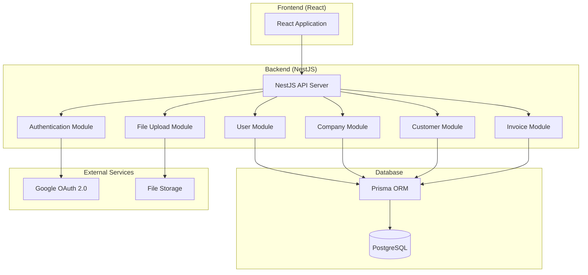
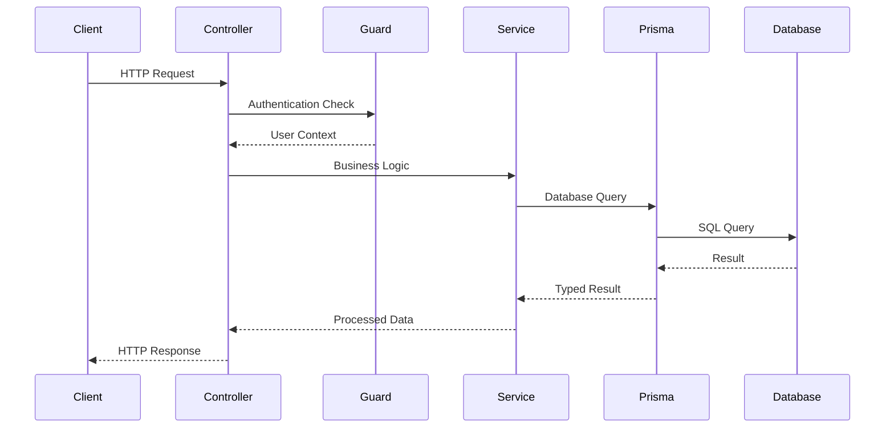
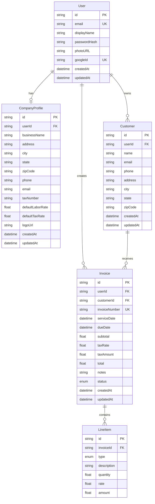

# Design Document: Invoice Backend API

## Overview

This document outlines the design for a comprehensive NestJS backend API that will replace the current localStorage-based data persistence in the Electrician Invoice Generation Web Application. The backend will provide a robust, scalable, and secure API using modern technologies including NestJS framework, PostgreSQL database with Prisma ORM, JWT-based authentication, and Google OAuth integration.

The design follows NestJS best practices with a modular architecture, proper separation of concerns, comprehensive validation, and enterprise-grade security measures. The API will provide full CRUD operations for users, company profiles, customers, and invoices while maintaining data integrity and user isolation.

## Architecture

### High-Level Architecture



### Module Architecture

The application follows NestJS modular architecture with clear separation of concerns:

1. **Core Modules**
   - `AppModule`: Root module that imports all feature modules
   - `DatabaseModule`: Prisma configuration and database connection
   - `ConfigModule`: Environment configuration management

2. **Feature Modules**
   - `AuthModule`: Authentication and authorization
   - `UserModule`: User profile management
   - `CompanyModule`: Company profile management
   - `CustomerModule`: Customer management
   - `InvoiceModule`: Invoice and line item management
   - `FileUploadModule`: File upload handling

3. **Shared Modules**
   - `CommonModule`: Shared utilities, decorators, and pipes
   - `ValidationModule`: Custom validation pipes and DTOs

### Request Flow



## Components and Interfaces

### Database Schema (Prisma)

```prisma
// User model for authentication
model User {
  id          String   @id @default(cuid())
  email       String   @unique
  displayName String
  passwordHash String?
  photoURL    String?
  googleId    String?  @unique
  createdAt   DateTime @default(now())
  updatedAt   DateTime @updatedAt
  
  // Relations
  companyProfile CompanyProfile?
  customers      Customer[]
  invoices       Invoice[]
  
  @@map("users")
}

// Company profile model
model CompanyProfile {
  id               String  @id @default(cuid())
  userId           String  @unique
  businessName     String
  address          String
  city             String
  state            String
  zipCode          String
  phone            String
  email            String
  taxNumber        String
  defaultLaborRate Float
  defaultTaxRate   Float
  logoUrl          String?
  createdAt        DateTime @default(now())
  updatedAt        DateTime @updatedAt
  
  // Relations
  user User @relation(fields: [userId], references: [id], onDelete: Cascade)
  
  @@map("company_profiles")
}

// Customer model
model Customer {
  id        String   @id @default(cuid())
  userId    String
  name      String
  email     String
  phone     String
  address   String
  city      String
  state     String
  zipCode   String
  createdAt DateTime @default(now())
  updatedAt DateTime @updatedAt
  
  // Relations
  user     User      @relation(fields: [userId], references: [id], onDelete: Cascade)
  invoices Invoice[]
  
  @@map("customers")
}

// Invoice model
model Invoice {
  id            String        @id @default(cuid())
  userId        String
  customerId    String
  invoiceNumber String        @unique
  serviceDate   DateTime
  dueDate       DateTime
  subtotal      Float
  taxRate       Float
  taxAmount     Float
  total         Float
  notes         String?
  status        InvoiceStatus @default(DRAFT)
  createdAt     DateTime      @default(now())
  updatedAt     DateTime      @updatedAt
  
  // Relations
  user      User       @relation(fields: [userId], references: [id], onDelete: Cascade)
  customer  Customer   @relation(fields: [customerId], references: [id], onDelete: Cascade)
  lineItems LineItem[]
  
  @@map("invoices")
}

// Line item model
model LineItem {
  id          String       @id @default(cuid())
  invoiceId   String
  type        LineItemType
  description String
  quantity    Float
  rate        Float
  amount      Float
  
  // Relations
  invoice Invoice @relation(fields: [invoiceId], references: [id], onDelete: Cascade)
  
  @@map("line_items")
}

// Enums
enum InvoiceStatus {
  DRAFT
  SENT
  PAID
}

enum LineItemType {
  MATERIAL
  LABOR
}
```

### Core Interfaces and DTOs

#### Authentication DTOs

```typescript
// Login DTO
export class LoginDto {
  @IsEmail()
  @IsNotEmpty()
  email: string;

  @IsString()
  @MinLength(6)
  password: string;
}

// Register DTO
export class RegisterDto {
  @IsEmail()
  @IsNotEmpty()
  email: string;

  @IsString()
  @MinLength(6)
  password: string;

  @IsString()
  @IsNotEmpty()
  displayName: string;
}

// JWT Payload
export interface JwtPayload {
  sub: string;
  email: string;
  displayName: string;
  iat?: number;
  exp?: number;
}

// Auth Response
export interface AuthResponse {
  user: UserResponseDto;
  accessToken: string;
  refreshToken: string;
}
```

#### User DTOs

```typescript
export class UserResponseDto {
  @Expose()
  id: string;

  @Expose()
  email: string;

  @Expose()
  displayName: string;

  @Expose()
  photoURL?: string;

  @Expose()
  createdAt: Date;

  @Expose()
  updatedAt: Date;
}

export class UpdateUserDto {
  @IsOptional()
  @IsString()
  displayName?: string;

  @IsOptional()
  @IsUrl()
  photoURL?: string;
}
```

#### Company Profile DTOs

```typescript
export class CreateCompanyProfileDto {
  @IsString()
  @IsNotEmpty()
  businessName: string;

  @IsString()
  @IsNotEmpty()
  address: string;

  @IsString()
  @IsNotEmpty()
  city: string;

  @IsString()
  @Length(2, 2)
  state: string;

  @IsString()
  @Matches(/^\d{5}(-\d{4})?$/)
  zipCode: string;

  @IsString()
  @Matches(/^\(?(\d{3})\)?[- ]?(\d{3})[- ]?(\d{4})$/)
  phone: string;

  @IsEmail()
  email: string;

  @IsString()
  @IsNotEmpty()
  taxNumber: string;

  @IsNumber()
  @Min(0)
  defaultLaborRate: number;

  @IsNumber()
  @Min(0)
  @Max(1)
  defaultTaxRate: number;
}

export class UpdateCompanyProfileDto extends PartialType(CreateCompanyProfileDto) {}
```

#### Customer DTOs

```typescript
export class CreateCustomerDto {
  @IsString()
  @IsNotEmpty()
  name: string;

  @IsEmail()
  email: string;

  @IsString()
  @Matches(/^\(?(\d{3})\)?[- ]?(\d{3})[- ]?(\d{4})$/)
  phone: string;

  @IsString()
  @IsNotEmpty()
  address: string;

  @IsString()
  @IsNotEmpty()
  city: string;

  @IsString()
  @Length(2, 2)
  state: string;

  @IsString()
  @Matches(/^\d{5}(-\d{4})?$/)
  zipCode: string;
}

export class UpdateCustomerDto extends PartialType(CreateCustomerDto) {}

export class CustomerQueryDto {
  @IsOptional()
  @IsString()
  search?: string;

  @IsOptional()
  @IsIn(['name', 'createdAt'])
  sortBy?: 'name' | 'createdAt';

  @IsOptional()
  @IsIn(['asc', 'desc'])
  sortOrder?: 'asc' | 'desc';

  @IsOptional()
  @Type(() => Number)
  @IsInt()
  @Min(1)
  page?: number = 1;

  @IsOptional()
  @Type(() => Number)
  @IsInt()
  @Min(1)
  @Max(100)
  limit?: number = 10;
}
```

#### Invoice DTOs

```typescript
export class CreateLineItemDto {
  @IsEnum(LineItemType)
  type: LineItemType;

  @IsString()
  @IsNotEmpty()
  @MaxLength(500)
  description: string;

  @IsNumber()
  @Min(0.01)
  @Max(10000)
  quantity: number;

  @IsNumber()
  @Min(0)
  @Max(100000)
  rate: number;
}

export class CreateInvoiceDto {
  @IsString()
  @IsNotEmpty()
  customerId: string;

  @Type(() => Date)
  @IsDate()
  serviceDate: Date;

  @Type(() => Date)
  @IsDate()
  dueDate: Date;

  @IsArray()
  @ValidateNested({ each: true })
  @Type(() => CreateLineItemDto)
  @ArrayMinSize(1)
  lineItems: CreateLineItemDto[];

  @IsOptional()
  @IsString()
  notes?: string;

  @IsNumber()
  @Min(0)
  @Max(1)
  taxRate: number;
}

export class UpdateInvoiceDto extends PartialType(CreateInvoiceDto) {}

export class UpdateInvoiceStatusDto {
  @IsEnum(InvoiceStatus)
  status: InvoiceStatus;
}

export class InvoiceQueryDto {
  @IsOptional()
  @IsEnum(InvoiceStatus)
  status?: InvoiceStatus;

  @IsOptional()
  @IsString()
  customerId?: string;

  @IsOptional()
  @Type(() => Date)
  @IsDate()
  dateFrom?: Date;

  @IsOptional()
  @Type(() => Date)
  @IsDate()
  dateTo?: Date;

  @IsOptional()
  @IsIn(['invoiceNumber', 'createdAt', 'serviceDate', 'total'])
  sortBy?: 'invoiceNumber' | 'createdAt' | 'serviceDate' | 'total';

  @IsOptional()
  @IsIn(['asc', 'desc'])
  sortOrder?: 'asc' | 'desc';

  @IsOptional()
  @Type(() => Number)
  @IsInt()
  @Min(1)
  page?: number = 1;

  @IsOptional()
  @Type(() => Number)
  @IsInt()
  @Min(1)
  @Max(100)
  limit?: number = 10;
}
```

### Service Interfaces

#### Authentication Service

```typescript
export interface IAuthService {
  register(registerDto: RegisterDto): Promise<AuthResponse>;
  login(loginDto: LoginDto): Promise<AuthResponse>;
  googleLogin(googleUser: GoogleUser): Promise<AuthResponse>;
  refreshToken(refreshToken: string): Promise<AuthResponse>;
  validateUser(payload: JwtPayload): Promise<User>;
  generateTokens(user: User): Promise<{ accessToken: string; refreshToken: string }>;
}
```

#### User Service

```typescript
export interface IUserService {
  findById(id: string): Promise<User>;
  findByEmail(email: string): Promise<User>;
  update(id: string, updateUserDto: UpdateUserDto): Promise<User>;
  delete(id: string): Promise<void>;
  changePassword(id: string, oldPassword: string, newPassword: string): Promise<void>;
}
```

#### Company Service

```typescript
export interface ICompanyService {
  create(userId: string, createCompanyProfileDto: CreateCompanyProfileDto): Promise<CompanyProfile>;
  findByUserId(userId: string): Promise<CompanyProfile>;
  update(userId: string, updateCompanyProfileDto: UpdateCompanyProfileDto): Promise<CompanyProfile>;
  uploadLogo(userId: string, file: Express.Multer.File): Promise<string>;
}
```

#### Customer Service

```typescript
export interface ICustomerService {
  create(userId: string, createCustomerDto: CreateCustomerDto): Promise<Customer>;
  findAll(userId: string, query: CustomerQueryDto): Promise<PaginatedResponse<Customer>>;
  findById(userId: string, id: string): Promise<Customer>;
  update(userId: string, id: string, updateCustomerDto: UpdateCustomerDto): Promise<Customer>;
  delete(userId: string, id: string): Promise<void>;
}
```

#### Invoice Service

```typescript
export interface IInvoiceService {
  create(userId: string, createInvoiceDto: CreateInvoiceDto): Promise<Invoice>;
  findAll(userId: string, query: InvoiceQueryDto): Promise<PaginatedResponse<Invoice>>;
  findById(userId: string, id: string): Promise<Invoice>;
  update(userId: string, id: string, updateInvoiceDto: UpdateInvoiceDto): Promise<Invoice>;
  updateStatus(userId: string, id: string, status: InvoiceStatus): Promise<Invoice>;
  delete(userId: string, id: string): Promise<void>;
  generateInvoiceNumber(): Promise<string>;
  calculateTotals(lineItems: CreateLineItemDto[], taxRate: number): InvoiceTotals;
}
```

## Data Models

### Entity Relationships



### Data Validation Rules

1. **User Data**
   - Email must be unique and valid format
   - Password minimum 6 characters (when using email/password auth)
   - Display name required and non-empty

2. **Company Profile Data**
   - Business name required
   - Address fields required and properly formatted
   - Phone number must match US format
   - Tax rates between 0 and 1
   - Labor rates must be positive

3. **Customer Data**
   - Name and contact information required
   - Email must be valid format
   - Phone number must match US format
   - Address fields required

4. **Invoice Data**
   - Must have at least one line item
   - Service date and due date required
   - Due date must be on or after service date
   - Tax rate between 0 and 1
   - Line item quantities and rates must be positive

## Correctness Properties

*A property is a characteristic or behavior that should hold true across all valid executions of a system-essentially, a formal statement about what the system should do. Properties serve as the bridge between human-readable specifications and machine-verifiable correctness guarantees.*

Now I need to analyze the acceptance criteria to determine which ones are testable as properties:

<function_calls>
<invoke name="prework">
<parameter name="featureName">invoice-backend-api

Based on the prework analysis, I'll now identify the testable properties and perform property reflection to eliminate redundancy:

**Property Reflection:**
After reviewing all testable properties, I've identified several areas where properties can be consolidated:
- Multiple validation properties (4.5, 5.5, 6.8, 7.11, 8.1) can be combined into comprehensive validation properties
- HTTP status code properties (4.6, 8.3) are redundant and can be combined
- Rate limiting properties (8.6, 11.3) are duplicates
- Input sanitization properties (8.8, 11.4) are duplicates
- Data isolation properties (6.9, 7.12) follow the same pattern and can be generalized

### Correctness Properties

Property 1: Database referential integrity enforcement
*For any* attempt to create a record with an invalid foreign key reference, the database should reject the operation and maintain referential integrity
**Validates: Requirements 2.6**

Property 2: JWT token generation and validation consistency
*For any* valid user authentication, the system should generate a valid JWT token that can be successfully validated and decoded to retrieve the original user information
**Validates: Requirements 3.1, 3.5**

Property 3: Google OAuth user profile management
*For any* successful Google OAuth authentication, the system should either create a new user profile or update an existing one based on the Google user information
**Validates: Requirements 3.2, 3.10**

Property 4: Email/password authentication round trip
*For any* user registration with email and password, the user should be able to successfully log in using the same credentials
**Validates: Requirements 3.3**

Property 5: Password hashing security
*For any* user password, the stored password hash should never match the plain text password and should be verifiable using bcrypt
**Validates: Requirements 3.4**

Property 6: Refresh token functionality
*For any* valid refresh token, the system should generate new access and refresh tokens while invalidating the old refresh token
**Validates: Requirements 3.6**

Property 7: Authentication guard protection
*For any* protected API endpoint, requests without valid authentication should be rejected with appropriate error responses
**Validates: Requirements 3.7**

Property 8: User data isolation
*For any* authenticated user, they should only be able to access and modify their own data (customers, invoices, company profile)
**Validates: Requirements 3.8, 6.9, 7.12**

Property 9: Email uniqueness validation
*For any* registration attempt with an email that already exists, the system should reject the registration with an appropriate error message
**Validates: Requirements 3.9**

Property 10: User profile CRUD operations
*For any* authenticated user, all user profile operations (retrieve, update, delete, password change) should work correctly and return appropriate responses
**Validates: Requirements 4.1, 4.2, 4.3, 4.4**

Property 11: Input validation consistency
*For any* API endpoint, invalid input data should be rejected with standardized error responses and appropriate HTTP status codes
**Validates: Requirements 4.5, 4.6, 4.7, 5.5, 6.8, 7.11, 8.1, 8.2, 8.3**

Property 12: Company profile management
*For any* authenticated user, they should be able to create, retrieve, and update exactly one company profile, with proper validation of business information
**Validates: Requirements 5.1, 5.2, 5.3, 5.6**

Property 13: File upload validation and handling
*For any* file upload attempt, the system should validate file type and size constraints, rejecting invalid files and properly storing valid image files
**Validates: Requirements 5.4, 5.7, 5.8, 8.7**

Property 14: Customer CRUD operations with search and pagination
*For any* authenticated user, all customer operations (create, retrieve, update, delete, search, sort, paginate) should work correctly and maintain data isolation
**Validates: Requirements 6.1, 6.2, 6.3, 6.4, 6.5, 6.6, 6.7**

Property 15: Invoice CRUD operations with calculations
*For any* authenticated user, all invoice operations should work correctly, with automatic calculation of totals and taxes based on line items
**Validates: Requirements 7.1, 7.2, 7.3, 7.4, 7.5, 7.6, 7.7**

Property 16: Invoice number uniqueness
*For any* invoice creation, the generated invoice number should be unique across the entire system
**Validates: Requirements 7.8**

Property 17: Invoice filtering and pagination
*For any* invoice list request with filters (status, customer, date range), the system should return correctly filtered, sorted, and paginated results
**Validates: Requirements 7.9, 7.10**

Property 18: Database error handling
*For any* database connection error or query failure, the system should handle the error gracefully and return appropriate error responses
**Validates: Requirements 8.4, 9.6**

Property 19: Rate limiting enforcement
*For any* API endpoint with rate limiting, excessive requests should be rejected with appropriate rate limit error responses
**Validates: Requirements 8.6, 11.3**

Property 20: Security input sanitization
*For any* user input containing potentially malicious content (SQL injection, XSS), the system should sanitize or reject the input appropriately
**Validates: Requirements 8.8, 11.4, 11.5, 11.6**

Property 21: Database transaction integrity
*For any* multi-step database operation, either all steps should succeed or all should be rolled back, maintaining data consistency
**Validates: Requirements 9.2**

Property 22: Soft delete implementation
*For any* entity that supports soft deletion, the delete operation should mark the record as deleted rather than physically removing it
**Validates: Requirements 9.7**

Property 23: Security headers and CORS configuration
*For any* API response, appropriate security headers should be present and CORS should be properly configured for frontend integration
**Validates: Requirements 11.1, 11.2, 11.7, 11.8**

Property 24: Health check endpoint availability
*For any* health check request, the system should return appropriate status information indicating system health
**Validates: Requirements 12.8**

## Error Handling

### Error Response Format

All API errors follow a standardized format:

```typescript
interface ApiErrorResponse {
  statusCode: number;
  message: string | string[];
  error: string;
  timestamp: string;
  path: string;
  details?: any;
}
```

### Error Categories

1. **Validation Errors (400)**
   - Invalid input data
   - Missing required fields
   - Format validation failures

2. **Authentication Errors (401)**
   - Invalid credentials
   - Expired tokens
   - Missing authentication

3. **Authorization Errors (403)**
   - Insufficient permissions
   - Resource access denied

4. **Not Found Errors (404)**
   - Resource not found
   - Invalid endpoints

5. **Conflict Errors (409)**
   - Duplicate email registration
   - Unique constraint violations

6. **Server Errors (500)**
   - Database connection failures
   - Unexpected system errors

### Global Exception Filter

```typescript
@Catch()
export class GlobalExceptionFilter implements ExceptionFilter {
  catch(exception: unknown, host: ArgumentsHost) {
    const ctx = host.switchToHttp();
    const response = ctx.getResponse<Response>();
    const request = ctx.getRequest<Request>();

    let status = HttpStatus.INTERNAL_SERVER_ERROR;
    let message = 'Internal server error';

    if (exception instanceof HttpException) {
      status = exception.getStatus();
      message = exception.message;
    } else if (exception instanceof PrismaClientKnownRequestError) {
      // Handle Prisma-specific errors
      status = this.handlePrismaError(exception);
      message = this.getPrismaErrorMessage(exception);
    }

    const errorResponse: ApiErrorResponse = {
      statusCode: status,
      message,
      error: HttpStatus[status],
      timestamp: new Date().toISOString(),
      path: request.url,
    };

    response.status(status).json(errorResponse);
  }
}
```

## Testing Strategy

### Testing Approach

The backend API will use a comprehensive testing strategy combining unit tests and property-based tests to ensure reliability and correctness.

#### Unit Testing
- **Controllers**: Test HTTP request/response handling
- **Services**: Test business logic and data transformations
- **Guards**: Test authentication and authorization logic
- **Pipes**: Test validation and transformation logic
- **Integration**: Test database operations and external service integrations

#### Property-Based Testing
- **Authentication Properties**: Test JWT generation, validation, and OAuth flows
- **Data Validation Properties**: Test input validation across all endpoints
- **Business Logic Properties**: Test invoice calculations, user isolation, and data integrity
- **Security Properties**: Test rate limiting, input sanitization, and access controls

### Testing Framework Configuration

```typescript
// jest.config.js
module.exports = {
  moduleFileExtensions: ['js', 'json', 'ts'],
  rootDir: 'src',
  testRegex: '.*\\.spec\\.ts$',
  transform: {
    '^.+\\.(t|j)s$': 'ts-jest',
  },
  collectCoverageFrom: [
    '**/*.(t|j)s',
    '!**/*.spec.ts',
    '!**/node_modules/**',
  ],
  coverageDirectory: '../coverage',
  testEnvironment: 'node',
  setupFilesAfterEnv: ['<rootDir>/test/setup.ts'],
};
```

### Property-Based Testing Configuration

Using `fast-check` library for property-based testing:

```typescript
// Property test example
describe('Invoice Calculation Properties', () => {
  it('should maintain calculation consistency', () => {
    fc.assert(fc.property(
      fc.array(lineItemArbitrary, { minLength: 1 }),
      fc.float({ min: 0, max: 1 }),
      (lineItems, taxRate) => {
        const totals = invoiceService.calculateTotals(lineItems, taxRate);
        const expectedSubtotal = lineItems.reduce((sum, item) => sum + (item.quantity * item.rate), 0);
        const expectedTaxAmount = expectedSubtotal * taxRate;
        const expectedTotal = expectedSubtotal + expectedTaxAmount;
        
        expect(totals.subtotal).toBeCloseTo(expectedSubtotal, 2);
        expect(totals.taxAmount).toBeCloseTo(expectedTaxAmount, 2);
        expect(totals.total).toBeCloseTo(expectedTotal, 2);
      }
    ), { numRuns: 100 });
  });
});
```

### Test Database Configuration

```typescript
// test/database.ts
export const setupTestDatabase = async () => {
  const prisma = new PrismaClient({
    datasources: {
      db: {
        url: process.env.TEST_DATABASE_URL,
      },
    },
  });

  await prisma.$executeRaw`DROP SCHEMA IF EXISTS test CASCADE`;
  await prisma.$executeRaw`CREATE SCHEMA test`;
  await prisma.$migrate.deploy();
  
  return prisma;
};
```

### Testing Requirements

1. **Minimum Coverage**: 80% code coverage for all modules
2. **Property Tests**: Minimum 100 iterations per property test
3. **Integration Tests**: Test all API endpoints with real database
4. **Security Tests**: Test authentication, authorization, and input validation
5. **Performance Tests**: Test critical endpoints under load
6. **Error Handling Tests**: Test all error scenarios and edge cases

Each property-based test must be tagged with the following format:
**Feature: invoice-backend-api, Property {number}: {property_text}**

This comprehensive testing strategy ensures that the backend API is reliable, secure, and maintains data integrity across all operations.