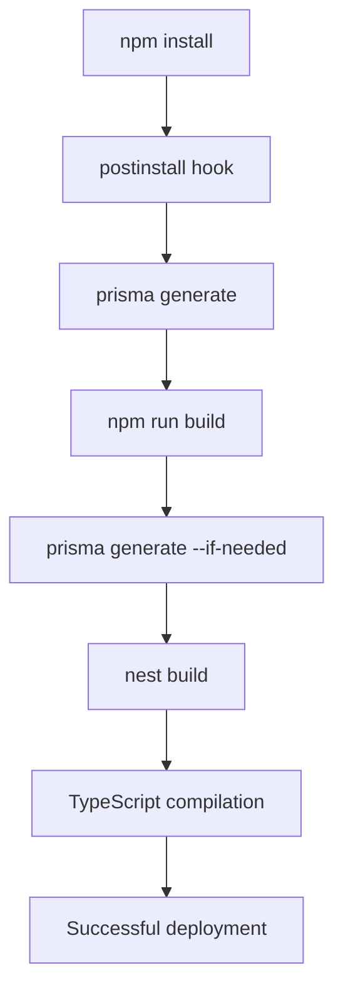

# Design Document: Prisma Deployment Fix

## Overview

This design addresses the Prisma client generation failure during deployment by modifying the build process to ensure Prisma types are available before TypeScript compilation. The solution involves updating build scripts, adding postinstall hooks, and ensuring proper dependency management.

## Architecture

The fix involves three main components:

1. **Build Script Enhancement**: Modify package.json build script to include Prisma generation
2. **Postinstall Hook**: Add automatic Prisma client generation after dependency installation
3. **Environment Handling**: Ensure build works with or without database connectivity

## Components and Interfaces

### Build Script Component
- **Purpose**: Orchestrate the build process with proper Prisma generation
- **Interface**: npm scripts in package.json
- **Dependencies**: Prisma CLI, NestJS CLI

### Postinstall Hook Component
- **Purpose**: Automatically generate Prisma client after dependency installation
- **Interface**: npm postinstall script
- **Dependencies**: @prisma/client, prisma

### Environment Handler Component
- **Purpose**: Handle Prisma generation in environments without database access
- **Interface**: Prisma CLI flags and environment variables
- **Dependencies**: Environment configuration

## Data Models

No new data models are required. The existing Prisma schema remains unchanged:

- User model
- RefreshToken model  
- CompanyProfile model
- Customer model
- Invoice model
- LineItem model
- Enums (InvoiceStatus, LineItemType)

## Correctness Properties

*A property is a characteristic or behavior that should hold true across all valid executions of a system-essentially, a formal statement about what the system should do. Properties serve as the bridge between human-readable specifications and machine-verifiable correctness guarantees.*

### Converting EARS to Properties

Based on the prework analysis, I'll convert the testable acceptance criteria into correctness properties:

**Property 1: Build Process Ordering**
*For any* build execution, when the build process starts, Prisma client generation should complete before TypeScript compilation begins
**Validates: Requirements 1.1, 2.1**

**Property 2: Type Generation Completeness**
*For any* Prisma schema with defined models, when Prisma client is generated, all model types (User, Customer, Invoice, RefreshToken, CompanyProfile, LineItem) should be present in the generated client
**Validates: Requirements 1.2**

**Property 3: Import Availability**
*For any* TypeScript file importing Prisma types, when TypeScript compilation runs, all Prisma imports should resolve successfully without compilation errors
**Validates: Requirements 1.3**

**Property 4: Build Success**
*For any* valid project configuration, when the build script runs, it should complete with exit code 0 and no TypeScript errors
**Validates: Requirements 1.4, 2.3**

**Property 5: CLI Availability**
*For any* environment after dependency installation, the prisma command should be available and executable
**Validates: Requirements 2.2, 4.1**

**Property 6: Environment Resilience**
*For any* build environment without DATABASE_URL, Prisma client generation should complete successfully without database connectivity
**Validates: Requirements 3.3**

**Property 7: Schema Change Detection**
*For any* modified Prisma schema, when the build process runs, the generated client should reflect the schema changes
**Validates: Requirements 3.4**

**Property 8: Dependency Completeness**
*For any* package installation, both @prisma/client and prisma packages should be present in node_modules
**Validates: Requirements 4.2**

**Property 9: Version Consistency**
*For any* build execution, the Prisma CLI version used should match the version specified in package.json
**Validates: Requirements 4.3**

**Property 10: Postinstall Hook Execution**
*For any* npm install execution, the postinstall hook should automatically generate Prisma client files
**Validates: Requirements 4.4**

## Error Handling

### Build Process Errors
- **Missing Prisma CLI**: Fail fast with clear error message
- **Schema Validation Errors**: Display Prisma validation errors clearly
- **TypeScript Compilation Errors**: Ensure Prisma types are available before compilation

### Environment Errors
- **Missing DATABASE_URL**: Allow Prisma generation to proceed without database connection
- **Network Issues**: Handle database connectivity problems gracefully during generation
- **Permission Issues**: Provide clear error messages for file system permission problems

### Dependency Errors
- **Version Mismatches**: Warn about Prisma version inconsistencies
- **Missing Dependencies**: Fail with clear instructions to install required packages
- **Corrupted node_modules**: Provide guidance for clean reinstallation

## Testing Strategy

### Unit Tests
- Test individual build script components
- Verify Prisma CLI availability after installation
- Test error handling for missing dependencies
- Validate schema parsing and type generation

### Property-Based Tests
- Test build process ordering across different project configurations
- Verify type generation completeness with various schema configurations
- Test environment resilience with different environment variable combinations
- Validate version consistency across different package.json configurations

**Property Test Configuration:**
- Minimum 100 iterations per property test
- Each property test references its design document property
- Tag format: **Feature: prisma-deployment-fix, Property {number}: {property_text}**

### Integration Tests
- Test complete build process from clean state
- Verify deployment compatibility with server environments
- Test postinstall hook behavior in various scenarios
- Validate TypeScript compilation with generated Prisma types

The testing approach ensures both specific examples work correctly (unit tests) and that the build process is robust across all possible configurations (property-based tests).